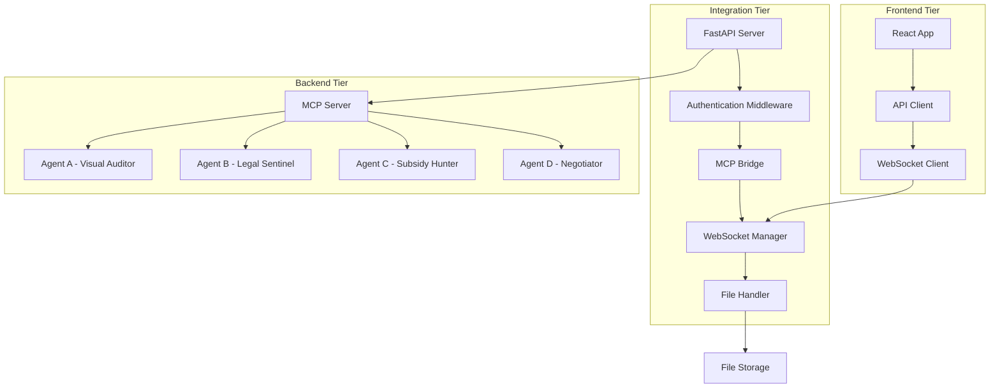

# Design Document: Frontend-Backend Integration

## Overview

The Frontend-Backend Integration creates a seamless bridge between the existing React frontend and the MCP server, enabling web-based access to all four financial agents (Visual Auditor, Legal Sentinel, Subsidy Hunter, and Negotiator). The design implements a FastAPI-based integration layer that translates between HTTP/WebSocket protocols and MCP tool calls while maintaining security, performance, and real-time capabilities.

## Architecture

The integration follows a three-tier architecture:



### Key Architectural Decisions

1. **FastAPI Integration Layer**: Chosen for its automatic OpenAPI documentation, async support, and Pydantic integration
2. **Dual Communication**: REST APIs for request-response operations, WebSockets for real-time updates
3. **Direct MCP Integration**: The integration layer imports and calls MCP tools directly rather than using network protocols
4. **Stateless Design**: Session state maintained in JWT tokens and database, not in-memory

## Components and Interfaces

### 1. FastAPI Integration Server

**Purpose**: Main HTTP server that bridges React frontend with MCP backend

**Key Components**:
- **Router Modules**: Separate routers for each agent (agents_a, agents_b, agents_c, agents_d)
- **Authentication Middleware**: JWT-based authentication with user context
- **CORS Handler**: Configurable cross-origin resource sharing
- **Error Handler**: Centralized error handling with user-friendly messages

**API Endpoints**:
```python
# Agent A - Visual Auditor
POST /api/v1/agents/visual-auditor/scan-invoice
POST /api/v1/agents/visual-auditor/upload-document

# Agent B - Legal Sentinel  
POST /api/v1/agents/legal-sentinel/check-compliance
GET /api/v1/agents/legal-sentinel/legal-updates

# Agent C - Subsidy Hunter
POST /api/v1/agents/subsidy-hunter/find-subsidies
GET /api/v1/agents/subsidy-hunter/schemes

# Agent D - Negotiator
POST /api/v1/agents/negotiator/generate-draft
POST /api/v1/agents/negotiator/analyze-email

# System endpoints
POST /api/v1/auth/login
GET /api/v1/auth/profile
GET /api/v1/health
```

### 2. MCP Bridge Component

**Purpose**: Translates between HTTP requests and MCP tool calls

**Interface**:
```python
class MCPBridge:
    def __init__(self, mcp_server: FastMCP):
        self.mcp = mcp_server
    
    async def call_tool(self, tool_name: str, **kwargs) -> dict:
        """Call MCP tool and return JSON-serializable result"""
    
    async def get_resource(self, resource_uri: str) -> dict:
        """Get MCP resource and return JSON result"""
    
    def serialize_pydantic(self, model: BaseModel) -> dict:
        """Convert Pydantic models to JSON-safe dictionaries"""
```

### 3. Authentication System

**Purpose**: Secure user authentication and session management

**Components**:
- **JWT Token Handler**: Issues and validates JWT tokens
- **User Context Manager**: Maintains user profile and business context
- **Role-Based Access**: Supports different user roles (owner, accountant, viewer)

**User Context Schema**:
```python
class UserContext(BaseModel):
    user_id: str
    business_name: str
    turnover_tier: str
    gst_registration_type: str
    industry_code: str
    role: str
    permissions: List[str]
```

### 4. WebSocket Manager

**Purpose**: Real-time communication for live updates and long-running operations

**Features**:
- **Connection Management**: Handle client connections and disconnections
- **Room-based Broadcasting**: Send updates to specific users or groups
- **Heartbeat Monitoring**: Detect and handle connection drops
- **Message Queuing**: Queue messages for offline clients

**WebSocket Events**:
```python
# Outbound events (server to client)
{
    "type": "legal_update",
    "data": {"title": "New GST Amendment", "relevance": "high"}
}

{
    "type": "processing_status", 
    "data": {"operation_id": "scan_123", "status": "processing", "progress": 45}
}

# Inbound events (client to server)
{
    "type": "subscribe_updates",
    "data": {"categories": ["gst", "income_tax"]}
}
```

### 5. File Handling System

**Purpose**: Secure upload, storage, and processing of documents

**Components**:
- **Upload Handler**: Validates and stores uploaded files
- **Temporary Storage**: Secure temporary file storage with cleanup
- **Access Control**: Ensures users can only access their own files
- **Format Validation**: Supports PDF, PNG, JPG, JPEG formats

**File Processing Flow**:
1. Client uploads file via multipart form data
2. Server validates file type, size, and user permissions
3. File stored in secure temporary location with UUID filename
4. MCP tool processes file using secure file path
5. Temporary file cleaned up after processing

## Data Models

### Request/Response Models

```python
# Agent A - Visual Auditor
class ScanInvoiceRequest(BaseModel):
    image_url: Optional[str] = None
    use_mock: bool = False

class ScanInvoiceResponse(BaseModel):
    invoice: Invoice
    processing_time: float
    confidence_score: float

# Agent B - Legal Sentinel
class ComplianceCheckRequest(BaseModel):
    query: str
    user_context: Optional[str] = None

class ComplianceCheckResponse(BaseModel):
    risk_assessment: LegalRisk
    relevant_documents: List[str]
    recommendations: List[str]

# Agent C - Subsidy Hunter
class SubsidySearchRequest(BaseModel):
    sector: str
    capex_amount: float
    location: Optional[str] = None

class SubsidySearchResponse(BaseModel):
    applicable_schemes: List[dict]
    estimated_benefits: float
    application_deadlines: List[str]

# Agent D - Negotiator
class NegotiationDraftRequest(BaseModel):
    counterparty_name: str
    context: str
    tone: str = "professional"

class NegotiationDraftResponse(BaseModel):
    draft_email: str
    key_points: List[str]
    suggested_attachments: List[str]
```

### Error Response Model

```python
class ErrorResponse(BaseModel):
    error: str
    message: str
    details: Optional[dict] = None
    timestamp: str
    request_id: str
```

Now I need to use the prework tool to analyze the acceptance criteria before writing the correctness properties:
## Correctness Properties

*A property is a characteristic or behavior that should hold true across all valid executions of a system-essentially, a formal statement about what the system should do. Properties serve as the bridge between human-readable specifications and machine-verifiable correctness guarantees.*

### Property Reflection

After analyzing all acceptance criteria, several properties can be consolidated to eliminate redundancy:

- Properties 1.1 and 1.5 both test MCP integration - combined into Property 1
- Properties 2.1, 2.3, and 2.5 all test authentication - combined into Property 2  
- Properties 3.1, 3.2, and 3.4 all test real-time updates - combined into Property 3
- Properties 4.1, 4.2, and 4.3 all test file handling - combined into Property 4
- Properties 5.1 and 5.3 both test error handling - combined into Property 5
- Properties 6.1 and 6.2 both test caching - combined into Property 6
- Properties 8.1, 8.2, and 8.3 all test data serialization - combined into Property 7

### Core Properties

**Property 1: MCP Integration Consistency**
*For any* valid frontend request, translating it through the Integration Layer to an MCP tool call and back should produce a response that maintains the semantic meaning and data integrity of the original MCP tool output.
**Validates: Requirements 1.1, 1.2, 1.5**

**Property 2: Authentication and Authorization**
*For any* user with valid credentials and appropriate role permissions, they should be able to access their authorized resources, while users with invalid credentials or insufficient permissions should be consistently denied access.
**Validates: Requirements 2.1, 2.3, 2.5**

**Property 3: Real-time Update Delivery**
*For any* relevant legal update or long-running operation status change, all connected clients who should receive the update based on their business profile should receive it within the specified time window.
**Validates: Requirements 3.1, 3.2, 3.4**

**Property 4: Secure File Processing**
*For any* uploaded file that meets the validation criteria, the file should be securely stored, processed by the appropriate MCP tool, and cleaned up afterward, with access restricted to the uploading user.
**Validates: Requirements 4.1, 4.2, 4.3, 4.4**

**Property 5: Error Handling and Logging**
*For any* error condition (MCP errors, system errors, validation failures), the Integration Layer should log the error with appropriate context and return a user-friendly error message without exposing internal system details.
**Validates: Requirements 5.1, 5.3, 8.4**

**Property 6: Performance and Caching**
*For any* legal query that has been cached, subsequent identical queries within the cache window should return the cached result, and the system should handle concurrent requests without blocking.
**Validates: Requirements 6.1, 6.2, 6.3**

**Property 7: Data Serialization Consistency**
*For any* MCP Pydantic model, serializing it to JSON and deserializing it back should produce an equivalent object, and all API communication should use valid JSON format.
**Validates: Requirements 8.1, 8.3**

**Property 8: Session Context Preservation**
*For any* authenticated user session, the user's business context (profile, turnover tier, industry) should be consistently maintained and passed to MCP tools throughout the session lifecycle.
**Validates: Requirements 2.2, 2.4**

**Property 9: WebSocket Connection Resilience**
*For any* WebSocket connection, the system should maintain the connection during normal operation and handle connection drops gracefully with automatic reconnection capabilities.
**Validates: Requirements 3.3, 3.5**

**Property 10: Multi-format File Support**
*For any* file in the supported formats (PDF, PNG, JPG, JPEG), the Integration Layer should correctly identify the format, validate it, and process it through the appropriate MCP tool.
**Validates: Requirements 4.5**

## Error Handling

### Error Categories and Responses

1. **Authentication Errors (401)**
   - Invalid or expired JWT tokens
   - Missing authentication headers
   - Response: `{"error": "authentication_failed", "message": "Please log in again"}`

2. **Authorization Errors (403)**
   - Insufficient role permissions
   - Access to resources outside user scope
   - Response: `{"error": "access_denied", "message": "You don't have permission to access this resource"}`

3. **Validation Errors (400)**
   - Invalid request data
   - Unsupported file formats
   - Response: `{"error": "validation_failed", "message": "Invalid input data", "details": {...}}`

4. **MCP Tool Errors (500)**
   - MCP tool execution failures
   - Backend service unavailable
   - Response: `{"error": "service_error", "message": "Unable to process request at this time"}`

5. **Rate Limiting Errors (429)**
   - Too many requests from client
   - Response: `{"error": "rate_limited", "message": "Too many requests, please try again later"}`

### Error Logging Strategy

- **Request Context**: Log user ID, endpoint, timestamp, request ID
- **Error Details**: Log full error stack trace (server-side only)
- **User Privacy**: Never log sensitive data (passwords, tokens, personal info)
- **Audit Trail**: Maintain compliance logs for financial operations

## Testing Strategy

### Dual Testing Approach

The testing strategy employs both unit tests and property-based tests to ensure comprehensive coverage:

**Unit Tests**: Focus on specific examples, edge cases, and integration points
- Authentication flow with valid/invalid tokens
- File upload with different formats and sizes
- WebSocket connection establishment and message handling
- Error response formatting for specific error conditions
- API endpoint availability and basic functionality

**Property-Based Tests**: Verify universal properties across all inputs using **Hypothesis** (Python property-based testing library)
- Each property test configured to run minimum 100 iterations
- Tests generate random valid inputs to verify properties hold universally
- Each test tagged with format: **Feature: frontend-backend-integration, Property {number}: {property_text}**

### Property Test Configuration

```python
# Example property test structure
@given(st.text(), st.floats(min_value=0))
@settings(max_examples=100)
def test_mcp_integration_consistency(query: str, amount: float):
    """
    Feature: frontend-backend-integration, Property 1: MCP Integration Consistency
    """
    # Test implementation here
```

### Testing Framework Setup

- **FastAPI TestClient**: For HTTP endpoint testing
- **pytest-asyncio**: For async operation testing  
- **WebSocket test client**: For real-time communication testing
- **Hypothesis**: For property-based testing with random input generation
- **Mock MCP tools**: For isolated integration layer testing

### Test Data Management

- **Synthetic Data Generation**: Create realistic but fake business profiles, invoices, and legal documents
- **Test Database**: Separate test database for integration tests
- **File Fixtures**: Sample files in all supported formats for upload testing
- **User Scenarios**: Predefined user roles and permissions for authorization testing

The testing strategy ensures that both specific use cases work correctly (unit tests) and that the system behaves correctly across all possible inputs (property tests), providing confidence in the integration layer's reliability and correctness.