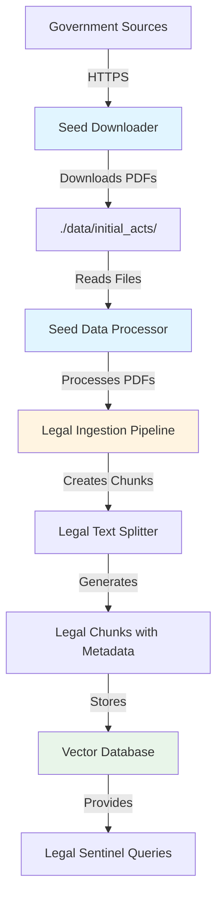

# Design Document: Legal Data Seeding System

## Overview

The Legal Data Seeding System automates the acquisition and ingestion of foundational Indian legal documents into the MicroCFO vector database. The system consists of three main components:

1. **Seed Downloader**: Downloads legal documents from official government sources with robust error handling
2. **Enhanced Legal Ingestion**: Processes PDFs with improved law type detection and structure-aware chunking
3. **Seed Data Processor**: Orchestrates the end-to-end pipeline from downloaded files to populated vector database

The system is designed to be idempotent, allowing safe re-execution without creating duplicate data. It handles common challenges with government websites including SSL certificate issues, complex PDF layouts, and network instability.

## Architecture

### Component Diagram



### Data Flow

1. **Download Phase**: Seed Downloader fetches PDFs from government URLs and stores them locally
2. **Processing Phase**: Seed Data Processor reads PDFs and invokes Legal Ingestion Pipeline
3. **Chunking Phase**: Legal Text Splitter creates structure-aware chunks with metadata
4. **Storage Phase**: Vector Database stores chunks with embeddings for semantic search
5. **Query Phase**: Legal Sentinel retrieves relevant chunks based on user queries

### Integration Points

- **Existing Legal Ingestion Pipeline** (`legal_ingestion.py`): Enhanced with improved law type detection
- **Existing Vector Database** (`vector_database.py`): Used without modification for chunk storage
- **Existing Setup Script** (`setup_legal_db.py`): Can be replaced or supplemented by seed data processor

## Components and Interfaces

### 1. Seed Downloader (`scripts/seed_downloader.py`)

**Purpose**: Download legal documents from official government sources with robust error handling.

**Key Classes**:

```python
class LegalDocumentSource:
    """Represents a legal document source with download metadata"""
    url: str
    filename: str
    description: str
    law_type: str  # For validation after download

class SeedDownloader:
    """Handles downloading of legal documents from government sources"""
    
    def __init__(self, output_dir: str = "./data/initial_acts/"):
        """Initialize downloader with output directory"""
        
    def download_document(self, source: LegalDocumentSource) -> bool:
        """Download a single document with retry logic"""
        
    def download_all(self, sources: List[LegalDocumentSource]) -> Dict[str, bool]:
        """Download all documents and return success status"""
        
    def _handle_ssl_error(self, url: str) -> requests.Response:
        """Retry download with SSL verification disabled"""
        
    def _retry_with_backoff(self, func: Callable, max_retries: int = 3) -> Any:
        """Execute function with exponential backoff retry logic"""
```

**Configuration**:

```python
LEGAL_SOURCES = [
    LegalDocumentSource(
        url="https://cbic-gst.gov.in/pdf/cgst-act.pdf",
        filename="CGST_Act_2017.pdf",
        description="Central Goods and Services Tax Act 2017",
        law_type="GST"
    ),
    LegalDocumentSource(
        url="https://cbic-gst.gov.in/pdf/igst-act.pdf",
        filename="IGST_Act_2017.pdf",
        description="Integrated Goods and Services Tax Act 2017",
        law_type="GST"
    ),
    LegalDocumentSource(
        url="https://incometaxindia.gov.in/pages/acts/income-tax-act.pdf",
        filename="Income_Tax_Act_1961.pdf",
        description="Income Tax Act 1961",
        law_type="Income Tax"
    ),
    LegalDocumentSource(
        url="https://www.indiacode.nic.in/bitstream/123456789/2114/1/A2013-18.pdf",
        filename="Companies_Act_2013.pdf",
        description="Companies Act 2013",
        law_type="Corporate Law"
    ),
    LegalDocumentSource(
        url="https://texprocil.org/pli-scheme-guidelines.pdf",
        filename="PLI_Textiles_Guidelines.pdf",
        description="Production Linked Incentive Scheme for Textiles",
        law_type="Subsidy Scheme"
    )
]
```

**Error Handling Strategy**:
- SSL certificate errors: Retry with `verify=False` and log warning
- Network timeouts: Exponential backoff (1s, 2s, 4s) for up to 3 retries
- HTTP errors: Log status code and continue with next download
- File system errors: Fail fast with clear error message

### 2. Enhanced Legal Ingestion (`legal_ingestion.py`)

**Purpose**: Process legal PDFs with improved law type detection and structure-aware chunking.

**Enhanced Functions**:

```python
def detect_law_type_from_filename(filename: str) -> str:
    """
    Detect law type from filename patterns
    
    Patterns:
    - CGST, IGST -> "GST"
    - Income Tax, IT Act -> "Income Tax"
    - Companies Act, MCA -> "Corporate Law"
    - PLI, Scheme -> "Subsidy Scheme"
    - Default -> "General"
    """
    
def extract_metadata_from_text(text: str, law_type: str) -> Dict[str, Any]:
    """
    Extract metadata from legal text
    
    Extracts:
    - turnover_threshold: Numeric values from "turnover exceeding X crore"
    - sector_tag: Industry keywords (textile, manufacturing, etc.)
    - effective_date: Date patterns like "w.e.f. DD-MM-YYYY"
    - section_number: Section identifiers from text
    """
    
def clean_pdf_text(text: str) -> str:
    """
    Clean extracted PDF text
    
    Removes:
    - Repetitive headers/footers
    - Page numbers
    - Excessive whitespace
    - Non-printable characters
    """
```

**Enhanced LegalDocumentProcessor**:

```python
class LegalDocumentProcessor:
    """Enhanced processor with better law type detection"""
    
    def process_pdf(self, pdf_path: str, law_type: str = None) -> List[LegalChunk]:
        """
        Process PDF with automatic law type detection
        
        If law_type is None, detect from filename
        Handle multi-column layouts and complex formatting
        """
        
    def _extract_text_from_pdf(self, pdf_path: str) -> str:
        """Extract text with layout preservation"""
        
    def _handle_extraction_error(self, pdf_path: str, error: Exception) -> None:
        """Log extraction errors and continue processing"""
```

**Metadata Extraction Patterns**:

```python
TURNOVER_PATTERNS = [
    r"turnover exceeding (?:Rs\.?\s*)?(\d+)\s*crore",
    r"aggregate turnover of (?:Rs\.?\s*)?(\d+)\s*crore",
    r"turnover of more than (?:Rs\.?\s*)?(\d+)\s*crore"
]

SECTOR_KEYWORDS = {
    "Textile": ["textile", "garment", "fabric", "apparel", "clothing"],
    "Manufacturing": ["manufacturing", "production", "factory", "industrial"],
    "Technology": ["software", "IT", "technology", "digital", "computer"],
    "Trading": ["trading", "commerce", "merchant", "dealer", "wholesale"]
}

DATE_PATTERNS = [
    r"w\.e\.f\.\s*(\d{2}-\d{2}-\d{4})",
    r"with effect from\s*(\d{2}-\d{2}-\d{4})",
    r"from\s*(\d{2}[/-]\d{2}[/-]\d{4})"
]
```

### 3. Seed Data Processor (`scripts/seed_data.py`)

**Purpose**: Orchestrate the end-to-end pipeline from downloaded PDFs to populated vector database.

**Key Classes**:

```python
class SeedDataProcessor:
    """Orchestrates PDF processing and database population"""
    
    def __init__(self, 
                 data_dir: str = "./data/initial_acts/",
                 db_path: str = "./legal_db/"):
        """Initialize processor with data and database paths"""
        self.data_dir = data_dir
        self.db_path = db_path
        self.legal_processor = LegalDocumentProcessor()
        self.vector_db = LegalVectorDB(db_path)
        
    def process_all_documents(self) -> ProcessingReport:
        """Process all PDFs in data directory and populate database"""
        
    def process_single_document(self, pdf_path: str) -> DocumentReport:
        """Process a single PDF and return statistics"""
        
    def _is_already_processed(self, pdf_path: str) -> bool:
        """Check if document has already been ingested"""
        
    def _get_file_hash(self, pdf_path: str) -> str:
        """Generate hash of file for duplicate detection"""
        
    def generate_report(self) -> str:
        """Generate human-readable processing report"""
```

**Data Structures**:

```python
@dataclass
class DocumentReport:
    """Report for a single document processing"""
    filename: str
    law_type: str
    chunks_created: int
    processing_time: float
    success: bool
    error_message: Optional[str] = None

@dataclass
class ProcessingReport:
    """Overall processing report"""
    total_documents: int
    successful_documents: int
    failed_documents: int
    total_chunks_created: int
    total_processing_time: float
    document_reports: List[DocumentReport]
```

**Progress Tracking**:

```python
class ProgressTracker:
    """Track and display processing progress"""
    
    def __init__(self, total_items: int):
        """Initialize with total number of items to process"""
        
    def update(self, current: int, message: str = ""):
        """Update progress and display message"""
        
    def complete(self, summary: str):
        """Mark processing as complete and display summary"""
```

### 4. Integration with Existing Components

**Vector Database Integration**:
- Use existing `LegalVectorDB` class without modification
- Call `add_documents()` method to store chunks
- Leverage existing embedding generation and indexing

**Legal Text Splitter Integration**:
- Use existing `LegalTextSplitter` for structure-aware chunking
- Preserve existing CA-logic based splitting
- Enhance metadata extraction without changing core splitting logic

**MCP Server Integration**:
- No changes required to `server.py`
- Legal Sentinel tools automatically benefit from expanded base layer
- Existing search and filtering logic works with new documents

## Data Models

### LegalDocumentSource

```python
@dataclass
class LegalDocumentSource:
    """Metadata for a legal document source"""
    url: str                    # Download URL
    filename: str               # Local filename to save as
    description: str            # Human-readable description
    law_type: str              # Expected law type for validation
    
    def validate_url(self) -> bool:
        """Validate URL format and accessibility"""
        
    def get_local_path(self, base_dir: str) -> Path:
        """Get full local path for downloaded file"""
```

### LegalChunk (Enhanced)

```python
@dataclass
class LegalChunk:
    """Enhanced legal chunk with comprehensive metadata"""
    text: str                           # Chunk text content
    law_type: str                       # GST, Income Tax, Corporate Law, etc.
    section_number: Optional[str]       # Section identifier
    chunk_type: str                     # main, proviso, sub_clause
    turnover_threshold: Optional[int]   # Threshold in rupees
    sector_tag: Optional[str]          # Textile, Manufacturing, etc.
    effective_date: Optional[str]      # ISO format date
    source_file: str                   # Original PDF filename
    page_number: Optional[int]         # Page number in source PDF
    
    def to_dict(self) -> Dict[str, Any]:
        """Convert to dictionary for database storage"""
        
    @classmethod
    def from_dict(cls, data: Dict[str, Any]) -> 'LegalChunk':
        """Create instance from dictionary"""
```

### ProcessingMetadata

```python
@dataclass
class ProcessingMetadata:
    """Metadata tracked during processing for idempotency"""
    file_path: str              # Path to processed file
    file_hash: str              # SHA256 hash of file content
    processing_timestamp: str   # ISO format timestamp
    chunks_created: int         # Number of chunks created
    law_type: str              # Detected law type
    
    def save_to_db(self, db: LegalVectorDB):
        """Save metadata to database for duplicate detection"""
        
    @classmethod
    def load_from_db(cls, db: LegalVectorDB, file_path: str) -> Optional['ProcessingMetadata']:
        """Load metadata from database"""
```

## Error Handling

### Download Errors

**SSL Certificate Errors**:
```python
try:
    response = requests.get(url, timeout=30, verify=True)
except requests.exceptions.SSLError:
    logger.warning(f"SSL verification failed for {url}, retrying without verification")
    response = requests.get(url, timeout=30, verify=False)
```

**Network Timeouts**:
```python
def download_with_retry(url: str, max_retries: int = 3) -> requests.Response:
    for attempt in range(max_retries):
        try:
            return requests.get(url, timeout=30)
        except requests.exceptions.Timeout:
            if attempt < max_retries - 1:
                wait_time = 2 ** attempt  # Exponential backoff
                logger.warning(f"Timeout on attempt {attempt + 1}, retrying in {wait_time}s")
                time.sleep(wait_time)
            else:
                raise
```

**HTTP Errors**:
```python
response = requests.get(url)
if response.status_code != 200:
    logger.error(f"HTTP {response.status_code} for {url}: {response.reason}")
    return None
```

### PDF Processing Errors

**Extraction Failures**:
```python
try:
    text = extract_text_from_pdf(pdf_path)
    if not text or len(text.strip()) == 0:
        logger.warning(f"Empty text extracted from {pdf_path}, skipping")
        return []
except Exception as e:
    logger.error(f"Failed to extract text from {pdf_path}: {str(e)}")
    return []
```

**Malformed PDFs**:
```python
try:
    pdf_reader = PyPDF2.PdfReader(pdf_path)
    num_pages = len(pdf_reader.pages)
except PyPDF2.errors.PdfReadError as e:
    logger.error(f"Malformed PDF {pdf_path}: {str(e)}")
    return []
```

### Database Errors

**Connection Failures**:
```python
try:
    vector_db = LegalVectorDB(db_path)
except Exception as e:
    logger.error(f"Failed to initialize vector database: {str(e)}")
    sys.exit(1)
```

**Storage Failures**:
```python
try:
    vector_db.add_documents(chunks)
except Exception as e:
    logger.error(f"Failed to store chunks: {str(e)}")
    # Continue processing other documents
```

### File System Errors

**Directory Creation**:
```python
try:
    os.makedirs(output_dir, exist_ok=True)
except OSError as e:
    logger.error(f"Failed to create directory {output_dir}: {str(e)}")
    sys.exit(1)
```

**File Write Errors**:
```python
try:
    with open(file_path, 'wb') as f:
        f.write(content)
except IOError as e:
    logger.error(f"Failed to write file {file_path}: {str(e)}")
    return False
```

## Testing Strategy

The Legal Data Seeding System will be tested using a dual approach combining unit tests for specific scenarios and property-based tests for universal correctness properties.

### Unit Testing Approach

Unit tests will focus on:
- **Specific examples**: Testing download of a single known document
- **Edge cases**: Empty PDFs, malformed URLs, missing directories
- **Error conditions**: Network failures, SSL errors, file system errors
- **Integration points**: Interaction with existing legal ingestion pipeline

### Property-Based Testing Approach

Property tests will verify universal properties across randomized inputs:
- **Download idempotency**: Re-downloading should skip existing files
- **Metadata extraction**: All extracted metadata should match expected patterns
- **Chunking consistency**: Same document should produce same chunks
- **Database round-trip**: Stored chunks should be retrievable with same content

### Test Configuration

- **Property tests**: Minimum 100 iterations per test
- **Test framework**: pytest with hypothesis for property-based testing
- **Mock data**: Sample PDFs for testing without network dependencies
- **Test isolation**: Each test should clean up created files and database entries

### Test Coverage Requirements

- **Download module**: 90%+ coverage including error paths
- **Enhanced ingestion**: 85%+ coverage including metadata extraction
- **Seed processor**: 90%+ coverage including orchestration logic
- **Integration tests**: End-to-end pipeline from download to database query


## Correctness Properties

A property is a characteristic or behavior that should hold true across all valid executions of a system—essentially, a formal statement about what the system should do. Properties serve as the bridge between human-readable specifications and machine-verifiable correctness guarantees.

### Property Reflection

After analyzing all acceptance criteria, I identified several areas of redundancy:

1. **Download examples (1.1-1.5)**: These five specific document downloads can be combined into a single example test
2. **Duplicate idempotency checks**: Requirements 1.7 and 8.1 both test file download idempotency
3. **Duplicate reporting**: Requirements 7.5 and 9.5 both test final summary reporting
4. **Law type detection (3.1-3.5)**: These can be combined into a single comprehensive property about pattern matching
5. **Sector tagging (6.3-6.4)**: These can be combined into a single property about keyword-based tagging
6. **Directory creation (10.1-10.3)**: These can be combined into a single property about required directories

The following properties represent the unique, non-redundant correctness guarantees after eliminating logical redundancy.

### Property 1: Download Idempotency

*For any* legal document source, if the target file already exists in the download directory, attempting to download it again should skip the download operation and leave the existing file unchanged.

**Validates: Requirements 1.7, 8.1**

**Pattern**: Idempotence (doing it twice = doing it once)

### Property 2: Download Location Consistency

*For any* legal document source that is successfully downloaded, the resulting file should be stored in the configured output directory with the specified filename.

**Validates: Requirements 1.6**

**Pattern**: Invariant (location property preserved across all downloads)

### Property 3: Download Logging Completeness

*For any* successful download operation, the system logs should contain an entry with the downloaded filename and file size.

**Validates: Requirements 1.8**

**Pattern**: Invariant (logging property preserved across all downloads)

### Property 4: SSL Error Recovery

*For any* download URL that fails with an SSL certificate error, the system should retry the request with SSL verification disabled and log a warning about the insecure connection.

**Validates: Requirements 2.1**

**Pattern**: Error recovery property

### Property 5: Timeout Retry with Exponential Backoff

*For any* download that encounters a network timeout, the system should retry up to 3 times with exponential backoff delays (1s, 2s, 4s) before failing.

**Validates: Requirements 2.2**

**Pattern**: Error recovery with specific retry policy

### Property 6: Graceful Failure Continuation

*For any* download that fails after all retry attempts, the system should log a detailed error message and continue processing the remaining downloads in the queue.

**Validates: Requirements 2.3**

**Pattern**: Fault tolerance (partial failure doesn't stop entire process)

### Property 7: HTTP Error Logging

*For any* download that receives an HTTP error status code, the system should log both the status code and error details.

**Validates: Requirements 2.4**

**Pattern**: Error reporting property

### Property 8: Download Summary Reporting

*For any* batch of downloads, when all downloads complete (successfully or with failures), the system should provide a summary report containing counts of successful and failed downloads.

**Validates: Requirements 2.5**

**Pattern**: Reporting invariant

### Property 9: Law Type Detection from Filename

*For any* filename, the law type detection function should classify it according to these rules:
- Contains "CGST" or "IGST" → "GST"
- Contains "Income Tax" or "IT Act" → "Income Tax"  
- Contains "Companies Act" or "MCA" → "Corporate Law"
- Contains "PLI" or "Scheme" → "Subsidy Scheme"
- No match → "General"

**Validates: Requirements 3.1, 3.2, 3.3, 3.4, 3.5**

**Pattern**: Classification property with exhaustive cases

### Property 10: Header/Footer Removal

*For any* PDF with repetitive header or footer content, the extracted text chunks should not contain the repetitive header/footer text.

**Validates: Requirements 4.2**

**Pattern**: Text cleaning invariant

### Property 11: Empty Content Handling

*For any* PDF that produces empty or whitespace-only text after extraction, the system should log a warning and skip processing that document without creating chunks.

**Validates: Requirements 4.5**

**Pattern**: Edge case handling

### Property 12: Extraction Error Tolerance

*For any* PDF page that fails during text extraction, the system should log the error and continue processing the remaining pages of the document.

**Validates: Requirements 4.4**

**Pattern**: Fault tolerance (partial failure doesn't stop document processing)

### Property 13: Section Boundary Detection

*For any* legal document text containing section patterns (e.g., "Section 5", "Section 12A"), the chunking process should identify these as section boundaries and create separate chunks accordingly.

**Validates: Requirements 5.1**

**Pattern**: Structure detection property

### Property 14: Proviso Clause Detection

*For any* legal document text containing proviso patterns (e.g., "Provided that", "Provided further that"), the chunking process should identify these as proviso clauses and mark them with chunk_type "proviso".

**Validates: Requirements 5.2**

**Pattern**: Structure detection property

### Property 15: Sub-clause Detection

*For any* legal document text containing sub-clause patterns (e.g., "(a)", "(b)", "(c)"), the chunking process should identify these as sub-clauses and mark them with chunk_type "sub_clause".

**Validates: Requirements 5.3**

**Pattern**: Structure detection property

### Property 16: Section Number Extraction

*For any* legal chunk created from text containing a section identifier, the chunk's section_number metadata field should contain the extracted section identifier.

**Validates: Requirements 5.4**

**Pattern**: Metadata extraction property

### Property 17: Chunk Type Preservation

*For any* legal chunk created during processing, the chunk_type field (main, proviso, or sub_clause) should be correctly identified based on the text content and preserved in the chunk metadata.

**Validates: Requirements 5.5**

**Pattern**: Classification invariant

### Property 18: Sector Tag Assignment

*For any* legal text containing sector keywords (textile, garment, manufacturing, production, etc.), the resulting chunks should have the appropriate sector_tag assigned based on the keyword mapping.

**Validates: Requirements 6.3, 6.4**

**Pattern**: Keyword-based classification property

### Property 19: Date Format Conversion

*For any* legal text containing date patterns (e.g., "w.e.f. 01-04-2023"), the extracted effective_date should be converted to ISO format (YYYY-MM-DD).

**Validates: Requirements 6.5**

**Pattern**: Format conversion property

### Property 20: Embedding Generation Completeness

*For any* legal chunk processed by the Seed Data Processor, an embedding vector should be generated using sentence transformers with the correct dimensionality for the model.

**Validates: Requirements 7.1**

**Pattern**: Invariant (all chunks have embeddings)

### Property 21: Database Storage Round-Trip

*For any* legal chunk stored in the vector database, retrieving it should return a chunk with identical text content, metadata fields, and embedding vector.

**Validates: Requirements 7.2**

**Pattern**: Round-trip property (store then retrieve = identity)

### Property 22: Search Index Creation

*For any* legal chunk stored in the vector database, it should be searchable by both section_number and law_type filters.

**Validates: Requirements 7.3**

**Pattern**: Indexing property

### Property 23: Document Processing Logging

*For any* document processed by the Seed Data Processor, the system logs should contain an entry with the document filename and the total number of chunks created from that document.

**Validates: Requirements 7.4**

**Pattern**: Logging invariant

### Property 24: Final Statistics Reporting

*For any* complete execution of the seeding pipeline, the system should provide a final report containing total documents processed, total chunks created, and processing time.

**Validates: Requirements 7.5, 9.5**

**Pattern**: Reporting invariant

### Property 25: Processing Idempotency

*For any* document that has already been processed and stored in the vector database, attempting to process it again should detect the existing data and skip re-processing.

**Validates: Requirements 8.2**

**Pattern**: Idempotence (processing twice = processing once)

### Property 26: Pipeline Idempotency

*For any* complete seeding pipeline execution, running the pipeline a second time should complete without errors and without creating duplicate chunks in the database.

**Validates: Requirements 8.4**

**Pattern**: Idempotence at system level

### Property 27: Duplicate Detection Consistency

*For any* two documents with the same filename and modification timestamp, the system should recognize them as duplicates and process only once.

**Validates: Requirements 8.5**

**Pattern**: Duplicate detection property

### Property 28: Download Progress Reporting

*For any* file being downloaded, the system should display progress messages containing the filename and current download status.

**Validates: Requirements 9.1**

**Pattern**: User feedback property

### Property 29: PDF Processing Progress Reporting

*For any* PDF being processed, the system should display progress messages containing the current page number and total page count.

**Validates: Requirements 9.2**

**Pattern**: User feedback property

### Property 30: Chunking Progress Reporting

*For any* document being chunked, the system should display the number of chunks created for that document.

**Validates: Requirements 9.3**

**Pattern**: User feedback property

### Property 31: Storage Progress Reporting

*For any* batch of chunks being stored in the vector database, the system should display storage progress as a percentage.

**Validates: Requirements 9.4**

**Pattern**: User feedback property

### Property 32: Required Directory Creation

*For any* execution of the seeding system, all required directories (`./data/initial_acts/`, `./scripts/`, `./legal_db/`) should exist before processing begins, creating them if necessary.

**Validates: Requirements 10.1, 10.2, 10.3**

**Pattern**: Precondition invariant

### Property 33: Directory Permission Correctness

*For any* directory created by the system, the directory should have read and write permissions for the executing user.

**Validates: Requirements 10.4**

**Pattern**: File system property

### Property 34: Directory Creation Error Handling

*For any* directory creation operation that fails, the system should log a clear error message and terminate execution rather than continuing with missing directories.

**Validates: Requirements 10.5**

**Pattern**: Fail-fast error handling
